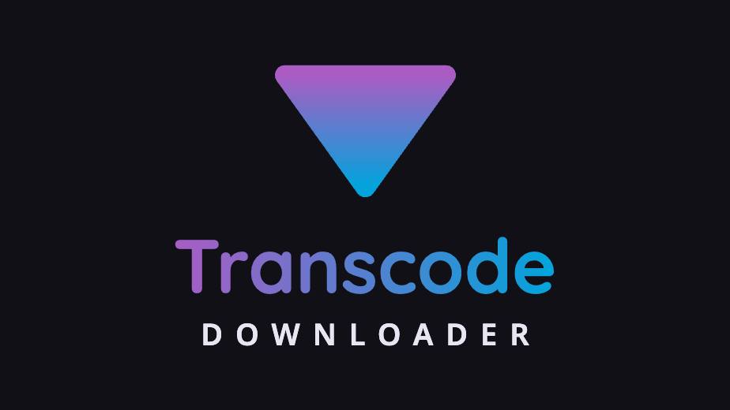
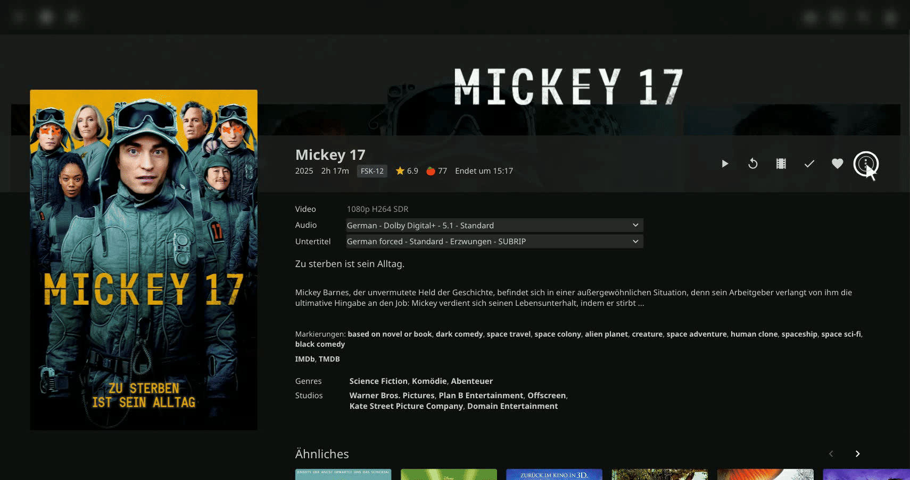

# Jellyfin Transcode Downloader




A Jellyfin **server plugin** that adds a quality-selection transcoded download option to the
More menu on item detail pages. Pick a quality tier and Jellyfin transcodes the file to
H.264/AAC on the fly. Use Jellyfin's built-in Download button to grab the original file.
## My other projects
- [PackShare](https://packshare.de) is a tool to plan your festival with your friends. One source of truth: what do we need, who buys it and who brings it. Includes a planning, buying and packing tool.
- [Easy Intervals MCP](https://easy-intervals.de) is a MCP Server for www.intervals.icu. This helps you to connect your favorite LLM to your health, fitness and trainings data. 

## How to download



After installing the plugin, open any **movie or episode detail page** in the Jellyfin web
client. Open the **"More" menu** (the `⋯` / kebab menu on the detail page) — a
**"Download (Transcode…)"** entry appears at the bottom of the list.

Selecting it opens a quality picker. Choose a bitrate tier — Jellyfin transcodes on the fly
and the plugin downloads the stream with a live progress bar. To grab the original file
without transcoding, use Jellyfin's own **Download** button that's already in the More menu.

You can queue multiple items: navigate to another movie or episode and add more downloads
while one is already in progress. Each queued item waits its turn and starts automatically
when the one ahead of it finishes.

### What happens in the background

Jellyfin encodes the video server-side to H.264/AAC at the selected bitrate and streams the
result. The plugin downloads the stream chunk by chunk, shows a live progress bar with an
estimated file size, and saves it as an `.mp4` once complete.

The estimated file size shown during a transcoded download is calculated from the selected
bitrate and the item's runtime (`~size = bitrate × duration ÷ 8`). It carries a `~`
prefix because VBR encoding means the real size can vary by ±10–15%.

### Download queue

A panel in the bottom-right corner shows all queued downloads. The active item displays a
progress bar; items waiting to start show "Waiting…". Each item has its own **✕** cancel
button — cancelling removes only that item and the next one starts automatically. The panel
disappears when the queue is empty.

The queue is in-memory only: closing or reloading the browser tab clears it.

Cancelling mid-download aborts the in-progress request cleanly; no partial file is saved.

## How it works

The plugin embeds a small client script and serves it from a plugin API endpoint
(`GET /TranscodeDownloader/ClientScript`). It then injects a single `<script>` tag into the
Jellyfin web client's `index.html` — **in memory**, via the File Transformation companion
plugin, so it never writes to Jellyfin's web directory. This is what makes it work on
standard package and Docker installs where the web root is read-only, and it survives
Jellyfin web updates.

## Requirements

- **Jellyfin 10.11.x** (built against the 10.11.8 SDK; ABI floor `10.11.8.0`).
- **File Transformation plugin** (>= **v2.2.1.0**) — strongly recommended (see below).

### Installing File Transformation (one-time)

1. In Jellyfin: **Dashboard → Plugins → Repositories → Add**, then add the File
   Transformation plugin repository.
2. **Dashboard → Plugins → Catalog**, install **File Transformation**.
3. Restart Jellyfin.

> Without File Transformation, the plugin falls back to patching `index.html` on disk.
> On most installs that directory is **read-only**, so the fallback fails and the button
> will not appear — the server log will say so and recommend installing File Transformation.
> **No filesystem permission changes are needed** when File Transformation is installed.

## Installing Transcode Downloader

### Production (stable releases)

1. Add this plugin's repository URL under **Dashboard → Plugins → Repositories**:
   ```
   https://raw.githubusercontent.com/ph15ch/Jellyfin-Transcode-Downloader/main/repo/manifest.json
   ```
2. Install **Transcode Downloader** from the catalog.
3. Restart Jellyfin.

### Testing (pre-release builds)

To follow test/pre-release builds, use the testing manifest instead:

1. Add the **testing** repository URL under **Dashboard → Plugins → Repositories**:
   ```
   https://raw.githubusercontent.com/ph15ch/Jellyfin-Transcode-Downloader/main/repo/manifest-testing.json
   ```
2. Install **Transcode Downloader** from the catalog.
3. Restart Jellyfin.

> Test builds may be unstable. They are marked as pre-releases on GitHub and only appear in
> the testing manifest — users on the production manifest are never affected.

After restart, open a movie or episode detail page and open the More menu — **"Download (Transcode…)"** appears in the list. (`[TranscodeDownloader] plugin loaded` prints in the browser console.)

## Building from source

```
dotnet publish src/JellyfinTranscodeDownloader.csproj -c Release -o publish/ -p:Version=1.2.3
```

The output `Jellyfin.Plugin.TranscodeDownloader.dll` is the entire plugin (the client
script is an embedded resource).

## Creating a release

Releases are fully tag-driven — no manual edits to the manifest or workflow inputs needed.

### Production release

1. **Write the changelog** as the message of an annotated git tag:
   ```
   git tag -a v1.2.3 -m "Short description of what changed"
   git push origin v1.2.3
   ```

2. **The `Release` workflow fires automatically** and:
   - Validates the tag is annotated (lightweight tags are rejected)
   - Builds with `dotnet publish -p:Version=1.2.3`
   - Zips the DLL → `jellyfin-transcode-downloader_1.2.3.zip`
   - Prepends a new version entry to `repo/manifest.json` on `main`
   - Creates a GitHub release and uploads the zip

### Test release

Use the `test/vX.Y.Z.N` tag prefix (note the **4-component version**). This triggers a
separate workflow that writes **only** to `repo/manifest-testing.json` and marks the
GitHub release as a pre-release. The production `repo/manifest.json` is never touched.

```
git tag -a test/v1.2.3.1 -m "Short description of what changed"
git push origin test/v1.2.3.1
```

The first three components (`X.Y.Z`) match the upcoming production release; `N` is an
iteration counter starting at 1. For example, test builds leading up to `v1.0.23` would
be `test/v1.0.23.1`, `test/v1.0.23.2`, etc. The workflow enforces 4 components and
rejects 3-component tags.

The `Release (Testing)` workflow runs identically to the production one, except:
- The zip is named `jellyfin-transcode-downloader_1.2.3.1-test.zip`
- The manifest entry goes into `repo/manifest-testing.json`
- The GitHub release is marked as a pre-release

> **Versions are immutable within each manifest** — pushing a tag whose version already
> exists in the target manifest will hard-fail the workflow. Cut a new tag to re-release.
